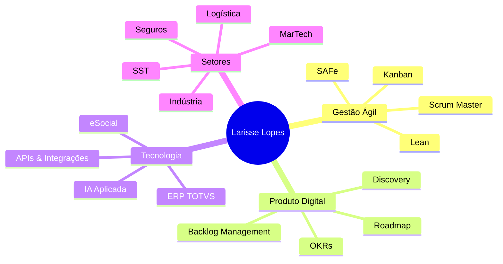

# larisselopes
<div align="center">


[](https://linkedin.com/in/larisselopes)
[](mailto:larisselopes@gmail.com)
[](https://www.google.com/maps/place/Aracaju)
[](https://www.scrumalliance.org/)

</div>

---

## 👩‍💼 Sobre Mim

```
💡 Gerente de Projetos Ágeis e Scrum Master com mais de 8 anos de experiência
📍 Aracaju, SE — Brasil  
🚀 Do discovery ao go-live: transformo ideias em produtos digitais reais
🎯 Perfil analítico, comunicativo e orientado a métricas
```

Apaixonada por conectar **negócio e tecnologia**, lidero squads multidisciplinares com foco em **entrega contínua de valor**, previsibilidade e eficiência operacional. Experiência em ambientes de alta complexidade técnica, com forte atuação em **backlog management**, **definição de requisitos** e **gestão de stakeholders**.

---

## 🛠️ Stack de Competências

<div align="center">

### Frameworks & Metodologias


### Ferramentas


### Domínios Técnicos


</div>

---

## 💼 Experiência Profissional & Projetos

### 🔵 CRP Tecnologia — *Project Leader*
`Fev/2026 – Atual` | Aracaju, SE

> A [CRP Tecnologia](https://crptecnologia.com.br/) é uma fábrica de software com mais de 18 anos de experiência, certificada MPS-BR, com projetos para SERPRO, Polícia Rodoviária Federal, SESI/SENAI e até projetos internacionais para o Governo de Angola.

**Responsabilidades:**
- 🎯 Liderança de times multidisciplinares em ambiente Scrum/Kanban
- 📋 Gestão e priorização de Product Backlog
- 🔄 Facilitação de todas as cerimônias ágeis (Daily, Planning, Review, Retrospective)
- 📊 Monitoramento de prazos, riscos e KPIs dos projetos
- 🤝 Interface direta com stakeholders e clientes
- ✍️ Refinamento de histórias de usuário e requisitos
- 📈 Implementação de melhorias contínuas de produtividade

---

### 🟣 Ubicua — *Software Development Project Manager*
`Jul/2024 – Ago/2025` | Remoto — São Paulo, SP

> A [Ubicua](https://ubicua.com.br/) é uma consultoria de tecnologia especializada em automação de processos, transformação digital e desenvolvimento de software sob medida, sediada em São Paulo.

#### 📦 Projeto: **Lorsa Jeans** — *Digitalização Industrial com ERP TOTVS*
```
Setor: Indústria Têxtil / Moda
Tipo: Sistema Web + Integração ERP
Status: ✅ Concluído
```
Substituição completa de processos manuais por sistema web integrado ao **ERP TOTVS**, abrangendo:
- **Módulo Financeiro** — automação de contas, fluxo de caixa e conciliações
- **Emissão Fiscal** — NFe, NFCe e rastreabilidade de documentos
- **Rastreabilidade Produtiva** — controle de produção do corte ao acabamento

> 💡 *A digitalização industrial como a realizada na Lorsa Jeans é uma tendência crescente no setor têxtil, onde a integração com ERPs como TOTVS permite visibilidade total da cadeia produtiva, redução de desperdícios e conformidade fiscal em tempo real.*

---

#### 🛡️ Projeto: **Resolve Assist** — *Hub Digital para Seguradoras*
```
Setor: Seguros / InsurTech
Tipo: Plataforma Digital B2B
Status: ✅ Concluído
```
Gestão do desenvolvimento de **hub digital** conectando seguradoras e prestadores de serviços, com foco em:
- Otimização do **fluxo operacional** de acionamentos e sinistros
- Melhoria da **experiência do cliente** em todas as etapas do atendimento
- Integração entre múltiplos parceiros via APIs

> 💡 *Plataformas de integração entre seguradoras e prestadores (como o modelo hub) são amplamente usadas no mercado de InsurTech para reduzir o tempo de atendimento ao segurado, aumentar a transparência nos processos e eliminar intermediários operacionais.*

---

### 🟢 Ateliware — *Scrum Master / Agile Master*
`Out/2023 – Jul/2024` | Remoto — Curitiba, PR

> A [Ateliware](https://ateliware.com) é uma software house de referência nacional, com operações no Brasil, Europa e EUA. Fundou startups de sucesso como **Pipefy** (operando em 150 países) e desenvolveu mais de 280 projetos para empresas como Votorantim, Renault, BMG Seguros e Sicoob.

#### 🚚 Projeto: **MatrixCargo** — *Plataforma de Logística com IA*
```
Setor: Logística / LogTech
Tipo: SaaS — Plataforma de Gerenciamento de Fretes
Status: ✅ Produto em produção | 🌐 matrixcargo.com.br
```

A [MatrixCargo](https://matrixcargo.com.br/) é uma plataforma logística que usa **Inteligência Artificial** para otimizar rotas, frotas e gerenciamento de fretes, com resultados comprovados:

| Métrica | Resultado |
|---|---|
| Redução no tempo de planejamento | **até 25x mais rápido** |
| Rotas mais eficazes | **+43% de eficiência** |
| Produtividade da frota | **+18,5%** |
| Tempo de comprovação de entrega | **de 54h para 7 segundos** |
| Capacidade de gestão | **5x maior** |

**Minha atuação no projeto:**
- 🔍 Facilitação do **Product Discovery** e refinamento contínuo do backlog
- 🔗 Integração entre times de **UX, engenharia e negócio** desde o MVP
- 📐 Condução de cerimônias ágeis e apoio à evolução do produto
- 📊 Monitoramento de **métricas de fluxo** e suporte a decisões data-driven

---

### 🟡 Software Zênit — *Analista de Projetos Ágeis / Scrum Master*
`Mai/2022 – Ago/2023` | Aracaju, SE

> A Software Zênit é uma empresa de desenvolvimento de software com atuação regional, especializada em sistemas de gestão para segmentos regulatórios, como SST e eSocial.

#### ⚙️ Projeto: **Sistema de SST** — *Segurança e Saúde no Trabalho*
```
Setor: RH / Saúde Ocupacional / Compliance
Tipo: Sistema Web + Integração eSocial / Receita Federal
Status: ✅ Concluído
```

Gestão do desenvolvimento de sistema de **Saúde e Segurança do Trabalho (SST)** com:
- Conformidade com normas regulamentadoras (NRs) e obrigações do **eSocial SST**
- Integração direta com a **Receita Federal** para envio de eventos eletrônicos
- Rastreabilidade de exames, laudos, EPIs e documentos ocupacionais
- Validação de requisitos funcionais, regulatórios e não funcionais

> 💡 *Sistemas de SST integrados ao eSocial são obrigatórios no Brasil e exigem alta atenção à conformidade legal. A gestão dessa complexidade regulatória num ambiente ágil requer domínio tanto técnico quanto de processos de negócio.*

---

### 🔴 Mr. Goose Group — *Gerente de Projetos / Scrum Master*
`Jun/2017 – Mai/2022` | Florianópolis, SC

> Grupo de tecnologia focado em **produtos digitais white-label**, ferramentas de marketing digital e soluções SaaS para criadores de conteúdo e pequenas empresas.

#### 🔗 Projeto: **Plataforma Link-in-Bio com CRM e Analytics**
```
Setor: MarTech / SaaS / Criadores de Conteúdo
Tipo: Produto Digital White-Label
Status: ✅ Produto entregue
```

Gestão de plataforma **link-in-bio** com camada de CRM integrado e analytics de engajamento:
- Apoio ao **Product Owner** na priorização orientada por valor e definição de roadmaps
- Condução de **testes com usuários** e acompanhamento de métricas de engajamento
- Facilitação de Scrum com times de design, engenharia e marketing
- Alinhamento contínuo entre stakeholders técnicos e de negócio

> 💡 *Plataformas de link-in-bio com CRM integrado são amplamente utilizadas por marcas e criadores de conteúdo para centralizar links, capturar leads e analisar comportamento de audiência — um segmento que cresceu significativamente com o avanço das redes sociais.*

---

## 🎓 Formação Acadêmica

| Curso | Instituição | Ano |
|---|---|---|
| 🤖 Pós-graduação em Ciência de Dados e IA | UNINTER | 2024 |
| 🏃 Pós-graduação em Gestão de Projetos Ágeis | UNINTER | 2024 |
| 📊 Pós-graduação em Gestão Estratégica de Negócios | UNIFAEL | 2017 |
| 🎓 Bacharelado em Administração | BILAC | 2013 |
| 💻 Tecnólogo em Sistemas da Informação | UNIBTA | 2005 |

---

## 🏆 Certificações

<div align="center">

| Certificação | Emissor | Status |
|---|---|---|
| 🥇 **Certified Scrum Master (CSM)** | Scrum Alliance | ✅ Ativa |
| 🤖 **Generative AI Fundamentals** | IBM | ✅ Concluída |
| 🟢 **Lean Six Sigma Green Belt** | FM2S | ✅ Concluída |
| 📋 **PMP — Project Management Professional** | PMI | 🔄 Em preparação |

</div>

---

## 🌍 Idiomas

| Idioma | Nível |
|---|---|
| 🇧🇷 Português | Nativo |
| 🇺🇸 Inglês | Intermediário |
| 🇪🇸 Espanhol | Intermediário |

---

## 📈 Áreas de Atuação



---

## 📊 Perfil Profissional

```
📦 Projetos liderados        ████████████████████  5+ projetos de ponta a ponta
👥 Gestão de Stakeholders    ████████████████████  Alta complexidade
🔄 Metodologias Ágeis        ████████████████████  8+ anos de experiência
📐 Definição de Requisitos   ███████████████████░  Funcional & Não Funcional
📊 Gestão por Métricas       ██████████████████░░  Data-driven
🤖 Inteligência Artificial   ████████████░░░░░░░░  Pós-graduada, em evolução
```

---

<div align="center">

### 💬 Vamos conversar?

[](https://linkedin.com/in/larisselopes)
[](mailto:larisselopes@gmail.com)
[_98139--3991-25D366?style=for-the-badge&logo=whatsapp&logoColor=white)](https://wa.me/5579981393991)


*"Tecnologia é o meio. Valor entregue é o destino."*

</div>